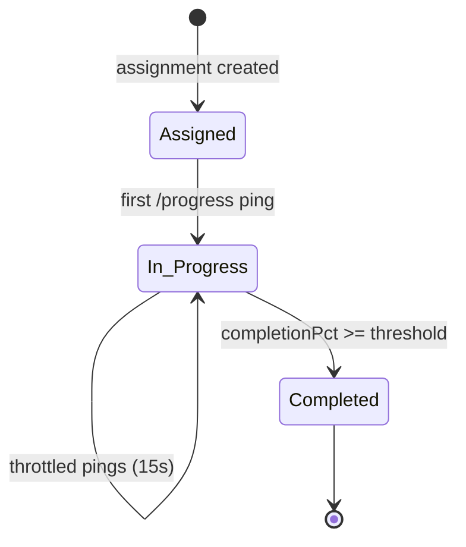

# HRMS — Training Module

## 1. Architecture Overview

The training module delivers an internal video-training platform: admins upload videos, assign them to employees, employees watch them (with resumable progress), and the module tracks completion, reactions, and threaded comments. Heavy work (video metadata + thumbnail extraction) is pushed to a background BullMQ worker so the API stays responsive.

It lives in three layers:

```
api/src/
├── modules/hrms/training/
│   ├── training.controller.ts              ← 19 REST endpoints (chunked upload + CRUD + social)
│   ├── training.service.ts                 ← Business logic (Drizzle/Postgres queries)
│   ├── training-upload.service.ts          ← Chunked upload session manager (raw binary, no Multer)
│   ├── training.module.ts                  ← Nest module wiring (imports QueueModule)
│   └── worker/
│       ├── video-processing.worker.ts      ← BullMQ worker: ffprobe + transcode + ffmpeg thumbnail
│       └── video-processing-worker.module.ts ← Standalone worker bootstrap module
├── infra/queue/queue.module.ts             ← Global; registers "VIDEO_PROCESSING_QUEUE"
├── db/schemas/hrms/
│   ├── training-videos.schema.ts
│   ├── training-assignments.schema.ts
│   ├── training-watch-history.schema.ts
│   ├── training-comments.schema.ts
│   ├── training-video-reactions.schema.ts
│   └── training-video-events.schema.ts     ← Declared but currently unused in code
└── worker.ts                               ← Multi-worker entrypoint (start:worker)
```

```
web/src/modules/hrms/
├── training/
│   ├── TrainingDashboard.tsx                ← Admin dashboard (courses + learners tabs)
│   ├── components/UploadVideo.tsx           ← Chunked upload wizard (init → 10 MB chunks → finalize → create)
│   ├── components/CourseTable.tsx
│   ├── components/AssignCourseModal.tsx
│   ├── components/LearnerProgressAccordion.tsx
│   ├── components/TrainingKpiCards.tsx
│   └── helpers/training.utils.ts
├── employees/
│   ├── EmployeeTrainingDashboard.tsx        ← Employee catalog (My Training)
│   └── VideoPlayer.tsx                      ← Player + progress pings + discussion panel
├── hooks/api/useTraining.ts                 ← TanStack Query hooks (keys + invalidation)
└── services/api/training.service.ts         ← Typed HTTP client (BaseApiService)
```

### Tech stack

| Layer | Tech |
|---|---|
| API | NestJS, Drizzle ORM (`@Inject(DRIZZLE)`), BullMQ + IORedis |
| Upload | Chunked raw-binary sessions (`application/octet-stream`, `x-chunk-index` header) — **no Multer/multipart** |
| Video processing | `fluent-ffmpeg` + `@ffmpeg-installer/ffmpeg` / `@ffprobe-installer/ffprobe` (ffprobe + transcode to faststart H.264/AAC) |
| Storage | Local disk (`./uploads/hrms/training` + `.chunks` staging), served statically at `/uploads/*` |
| Auth | Global `JwtAuthGuard` (default-deny via `@Public()` opt-out) |
| Web | React + Vite, TanStack Query, framer-motion, shadcn/ui, raw `axios` for chunk uploads |

**Queue wiring** (`infra/queue/queue.module.ts:44`): the global `QueueModule` provides `VIDEO_PROCESSING_QUEUE` (BullMQ queue `"video-processing-queue"`). When Redis is unavailable it substitutes a no-op `{ add: async () => {} }` so the API still boots (upload silently skips processing).

**Upload storage layout:**

```
uploads/hrms/training/
├── .chunks/<uploadId>/        ← staging per upload session (module init)
│   ├── session.json           ← { uploadId, expectedSize, receivedBytes, nextChunkIndex, status, ... }
│   └── part.bin               ← append-only staged bytes
├── trn-video-<ts>-<rand9>.<ext>   ← finalized upload (before processing)
├── processed/trn-<videoId>.mp4    ← worker-transcoded faststart H.264/AAC file
└── thumbnails/thumb-<videoId>-<ts>.jpg
```

---

## 2. Data Model

Six tables under the `hrms_*` prefix, all defined with Drizzle `pgTable`:

```mermaid
erDiagram
    USERS ||--o{ TRAINING_VIDEOS : "uploaded_by"
    USERS ||--o{ TRAINING_ASSIGNMENTS : "user_id / assigned_by"
    TRAINING_VIDEOS ||--o{ TRAINING_ASSIGNMENTS : "video_id"
    USERS ||--o{ TRAINING_WATCH_HISTORY : "user_id"
    TRAINING_VIDEOS ||--o{ TRAINING_WATCH_HISTORY : "video_id"
    USERS ||--o{ TRAINING_COMMENTS : "user_id"
    TRAINING_VIDEOS ||--o{ TRAINING_COMMENTS : "video_id"
    TRAINING_COMMENTS ||--o{ TRAINING_COMMENTS : "parent_comment_id (self-ref)"
    USERS ||--o{ TRAINING_VIDEO_REACTIONS : "user_id"
    TRAINING_VIDEOS ||--o{ TRAINING_VIDEO_REACTIONS : "video_id"
    USERS ||--o{ TRAINING_VIDEO_EVENTS : "user_id"
    TRAINING_VIDEOS ||--o{ TRAINING_VIDEO_EVENTS : "video_id"

    USERS {
        bigint id PK
    }
    TRAINING_VIDEOS {
        bigserial id PK
        varchar video_code UK
        varchar status "processing|ready|failed"
        integer completion_threshold
        boolean is_published
    }
    TRAINING_ASSIGNMENTS {
        bigserial id PK
        bigint video_id FK
        bigint user_id FK
        bigint assigned_by FK
        varchar status "Assigned|In Progress|Completed"
    }
    TRAINING_WATCH_HISTORY {
        bigserial id PK
        bigint user_id FK
        bigint video_id FK
        integer last_position_secs
        integer total_watch_secs
        numeric completion_pct
        boolean is_completed
        UNIQUE(user_id, video_id)
    }
    TRAINING_COMMENTS {
        bigserial id PK
        bigint parent_comment_id FK
        integer depth_level
        text body
        boolean is_deleted
    }
    TRAINING_VIDEO_REACTIONS {
        bigserial id PK
        bigint video_id FK
        bigint user_id FK
        varchar reaction
        UNIQUE(user_id, video_id, reaction)
    }
```

### 2.1 Tables

| Table | Purpose | Notable columns / constraints |
|---|---|---|
| `hrms_training_videos` | Course metadata | `filepath` (local disk path), `status` default `processing`, `storageProvider` default `VPS`, `completionThreshold` default 90, `isPublished` default true; `videoCode` unique `TRN-<ts>-<rand>` |
| `hrms_training_assignments` | Who must watch what | Composite business key `(video_id, user_id)`; `status` default `Assigned` |
| `hrms_training_watch_history` | Per (user, video) progress | `UNIQUE(user_id, video_id)`; `completionPct` is `numeric(5,2)` storing a string |
| `hrms_training_comments` | Threaded discussion | Self-referencing `parentCommentId`, `depthLevel`, soft-delete fields (`isDeleted`, `originalBody`) — soft-delete utilities not wired into service |
| `hrms_training_video_reactions` | Helpful / Key Info / Confusing | `UNIQUE(user_id, video_id, reaction)` — one of each reaction per user |
| `hrms_training_video_events` | Play/pause/seek event log | **Schema only** — `trainingVideoEvents` is exported but never referenced by any service; dead code |

### 2.2 Video status lifecycle

```
processing ──(worker: ffprobe OK + transcode + thumbnail)──▶ ready
           └──(worker: error)─────────────────────────────▶ failed
```

Status is written at `create` (`processing`), then by the worker via the BullMQ job. The worker may also **rewrite the stored file**: on successful transcode it updates `filepath`/`filename`/`filesize` to the normalized MP4 and deletes the original upload. An upload that fails DB-insert or queue-add is rolled back (file deleted) in `training.service.ts:92-105`.

---

## 3. API Reference

All routes under global prefix `/api/v1`, controller `@Controller('hrms/training')`. Auth scope: global `JwtAuthGuard` applies to every route **except** `GET :id/stream` which is `@Public()`.

| # | Method | Path | Auth | Function | Service method |
|---|---|---|---|---|---|
| 1 | POST | `/upload/init` | JWT | Start a chunked-upload session (`fileSize`, `originalName`, optional `totalChunks`) → `{ uploadId }` | `uploadService.init` |
| 2 | POST | `/upload/chunk/:uploadId` | JWT | Append raw bytes (body = `application/octet-stream`, order enforced via `x-chunk-index` header) | `uploadService.appendChunk` |
| 3 | POST | `/upload/finalize/:uploadId` | JWT | Validate byte count & rename part → final file; marks session `uploaded` | `uploadService.finalize` |
| 4 | DELETE | `/upload/:uploadId` | JWT | Abort upload (removes staging + finalized file) | `uploadService.abort` |
| 5 | POST | `/videos` | JWT | Create course record referencing a finalized `uploadId`; enqueue `process-video`; cleans up session | `service.create` |
| 6 | GET | `/` | JWT | List videos + aggregated reaction counts | `findAll` |
| 7 | POST | `/:id/toggle-publish` | JWT | Flip `isPublished` | `togglePublish` |
| 8 | GET | `/:id/stream` | **Public** | Range-request video streaming | (inline) |
| 9 | DELETE | `/:id` | JWT | Delete file + thumbnail + all children + row | `remove` |
| 10 | GET | `/employees` | JWT | Active users (for assign picker) | `getEmployees` |
| 11 | POST | `/assignments` | JWT | Assign video to users (dedupe) | `assignVideo` |
| 12 | GET | `/assignments` | JWT | Learner progress report | `getLearnersProgress` |
| 13 | GET | `/my-assignments` | JWT | Logged-in user's courses + progress | `getEmployeeAssignments` |
| 14 | POST | `/progress` | JWT | Upsert watch-history/ completion | `logProgress` |
| 15 | POST | `/videos/:id/reactions` | JWT | Add/switch reaction | `addReaction` |
| 16 | DELETE | `/videos/:id/reactions` | JWT | Remove reaction | `removeReaction` |
| 17 | GET | `/videos/:id/reactions` | JWT | Counts + my reaction | `getReactions` |
| 18 | POST | `/videos/:id/comments` | JWT | Add comment / reply | `addComment` |
| 19 | GET | `/videos/:id/comments` | JWT | Threaded comment list | `getComments` |

### 3.1 Chunked upload flow

**Files:** `training.controller.ts:23-80`, `training-upload.service.ts` (342 lines)

Upload is a **5-phase raw-binary session** — no multipart/Multer. This replaces the old single `POST /upload` FormData request.

```mermaid
sequenceDiagram
    participant Client
    participant C as TrainingController
    participant U as TrainingUploadService
    participant S as TrainingService
    participant R as Redis BullMQ

    Client->>C: POST /upload/init {fileSize, originalName, totalChunks}
    C->>U: init()
    U->>U: uploadId = randomUUID(); save session.json in .chunks/<uploadId>/
    U-->>Client: 201 {uploadId}

    loop for each 10 MB slice (index 0..n-1)
        Client->>C: POST /upload/chunk/:uploadId (raw bytes, header x-chunk-index)
        C->>U: appendChunk() — index must equal nextChunkIndex
        U->>U: append to part.bin; receivedBytes += bytes; nextChunkIndex++
        U-->>Client: { receivedBytes, expectedSize }
    end

    Client->>C: POST /upload/finalize/:uploadId
    C->>U: finalize() — partSize === expectedSize, rename part.bin → final file
    U-->>Client: { uploadId, filename, filepath, filesize }

    Client->>C: POST /videos {uploadId, title, category, ...}
    C->>U: resolveUploadedFile(uploadId)
    C->>S: create() → INSERT videos (status=processing) → queue.add process-video
    C->>U: complete(uploadId) — delete session dir
    C-->>Client: 201 {id, status: "processing"}

    Note over R: worker picks up job → §4 (ffprobe, transcode, thumbnail)
```

**Session rules** — the load-bearing part of this flow:

- Chunks must arrive **strictly in order** — `appendChunk` rejects any chunk whose index != `nextChunkIndex` (`training-upload.service.ts:122-129`). A retry/resume that re-sends a chunk fails with `400` (no idempotent skip of already-received chunks).
- At `finalize` the server **compares `part.bin`'s actual size to `expectedSize`** and rejects incomplete uploads (`training-upload.service.ts:179-186`), then renames `part.bin` → `uploads/hrms/training/trn-video-<ts>-<rand9>.<ext>` and marks the session `uploaded`.
- `POST /videos` never accepts a client-supplied path — it resolves the file **server-side** from the session (`resolveUploadedFile`, `training-upload.service.ts:219-240`), then removes the staged session dir (`complete`, `:245-254`). If the DB insert or queue-add fails, `service.create` unlinks the finalized file (`training.service.ts:99-103`) — no orphaned bytes.
- The client caps at 500 MB, slices into 10 MB chunks (`VITE_UPLOAD_CHUNK_SIZE`, default 10 MB) and shows live % from per-chunk byte progress (`UploadVideo.tsx:189-229`); a `413` from a proxy is caught and surfaced. On failure, the client calls `DELETE /upload/:uploadId` to abort and erase state (`:263-269`).
- Stale sessions (> 24 h) are swept on module boot (`sweepStaleSessions`, `training-upload.service.ts:309-337`).

### 3.2 Streaming (`GET /:id/stream`)

**File:** `training.controller.ts:92-145` — `@Public()`, no JWT required, resolves `video.filepath` and supports HTTP Range:

- With `Range: bytes=start-end` → `206 Partial Content`, `Content-Range`, chunked read stream (invalid range → `416` with `Content-Range: bytes */size`).
- Without a Range header → full-file `200`.
- MIME type from extension map (`mp4`, `mov`, `webm`, `avi`, `mkv`); unknown falls back to `video/mp4`.

### 3.3 Progress logging (`POST /progress`)

**File:** `training.service.ts:303-356`

Client sends `{ videoId, lastPositionSecs, totalWatchSecs, completionPct }` (15 s heartbeats from the player, `VideoPlayer.tsx:108-123`). Server:

1. Computes `isCompleted = completionPct >= (video.completionThreshold || 90)`.
2. Selects existing `(user, video)` watch-history row (thin race window — see practice review).
3. **No row** → insert with `watchCount: 1`; **row** → add `totalWatchSecs`, update position/pct/timestamps, optionally set `isCompleted` + `completedAt`.
4. Marks the assignment `In Progress` / `Completed`.



### 3.4 Comments & reactions

- **Reactions** (`training.service.ts:357-399`): one row per `(user, video, reaction)`; `addReaction` deletes any prior reaction the user had on that video, so effectively single active reaction per user (Delete→Insert, not `onConflictDoUpdate`).
- **Comments** (`training.service.ts:400-486`): replies get `parentCommentId` + `depthLevel = parent.depthLevel + 1`. `getComments` flat-queries all rows ordered by `createdAt`, builds the tree in-memory using a `commentsById` map (parent must sort before reply — true for chronological creation).

---

## 4. Background Processing Worker

**Files:** `worker.ts` (entry), `worker/video-processing-worker.module.ts`, `worker/video-processing.worker.ts`

The worker bootstraps as a **separate Nest application context** (birthed via `start:worker`), listens on `"video-processing-queue"` with `concurrency: 2` (`video-processing.worker.ts:29`). On a job it:

1. `ffprobe` the file → `durationSeconds` (default 15 when missing), first video stream resolution (→ `1280x720`).
2. **Transcodes to a faststart H.264/AAC MP4** (`video-processing.worker.ts:58-95`): `libx264` + `aac`, filter `scale='min(1080,ih)':-2`, options `-movflags +faststart -preset veryfast -crf 23`, output to `uploads/hrms/training/processed/trn-<videoId>.mp4`. On success the DB `filepath`/`filename`/`filesize` are repointed to the processed file and the original upload is deleted (`:126-152`). On transcode failure the worker **falls back to the original file** (warn + keep) so the job still succeeds.
3. Generates a JPEG thumbnail: 640 px wide, frame at `min(max(2, 10% of duration), duration - 1)` seconds (never past the end), sourced from the processed file when available (`:97-123`).
4. Updates the video row to `status="ready"`; on error flips `status="failed"` and rethrows so BullMQ retries (3 attempts, exponential backoff).

```mermaid
flowchart TD
    J[job process-video<br/>{videoId, filepath}] --> P[ffprobe metadata]
    P --> RG[resolve duration + resolution]
    RG --> TC{transcode H.264/AAC<br/>faststart MP4}
    TC -->|success| TH[ffmpeg frame at 10% → thumbnail]
    TC -->|failure| TH2[keep original file → thumbnail]
    TH --> U[UPDATE videos SET ready<br/>+ repoint filepath to processed]
    TH2 --> U
    U --> D[Done]
    U --> O[unlink original upload if transcoded]
    P --> E1[ERROR]
    TH --> E1
    U --> E1
    E1 --> X[UPDATE videos SET failed]
    X --> R[retry job attempt 2/3 → exponential backoff]
```

**Operational note:** thumbnails, processed files and raw videos live on local app-disk and are served **unauthenticated** under `/uploads/*` (`main.ts` `app.useStaticAssets`, prefix `/uploads`). The transcoded file is the one streamed (`filepath` in DB), so clients always get a browser-friendly MP4 even when the upload was a `.mov`/`.mkv`.

---

## 5. Frontend Integration

### 5.1 Pages & roles

| Page | Role | Data |
|---|---|---|
| `TrainingDashboard.tsx` | Admin | `useTrainingVideos` + `useLearnersProgress` + `useTrainingEmployees`; KPI cards; courses table (search/filter); learners accordion (per-user progress, dept filter) |
| `UploadVideo.tsx` | Admin | Drag-drop, category/tags/threshold, optional assign-on-upload, **5-call chunked upload** (init → 10 MB chunk loop → finalize → create), 500 MB client cap, live byte-based progress, 413 handling, session abort on failure |
| `AssignCourseModal.tsx` | Admin | Pick video + multi-select employees → `POST /assignments` |
| `EmployeeTrainingDashboard.tsx` | Employee | Assigned vs Completed tabs, per-course cards with resumes |
| `VideoPlayer.tsx` | Employee | HTML5 `<video>` + throttled progress pings + seek-lock + reactions + threaded discussion |

### 5.2 Player behavior (`VideoPlayer.tsx`)

- **Resume:** `onLoadedMetadata` seeks to `(progress / 100) * duration` and marks a pending-resume flag (`:102-112`).
- **Seek-lock:** `handleSeeking` rejects any user seek that jumps > 0.5 s from `lastGoodTimeRef` (unless it is the pending resume seek), preventing accidental scrub past the watch position (`:114-125`).
- **Throttled pings:** progress logged at most every **15 s**, or immediately when the completion threshold is crossed (`:82-98`); admins (`isAdmin`) never log progress (`:80`).
- **Completion UX:** crossing the threshold fires a congratulations toast; the progress bar turns green at `>= 90`.

### 5.3 React Query surface (`useTraining.ts`)

Structured keys (`trainingKey.*`) with invalidation on mutations: create, delete, toggle-publish → `lists()`; assign → `progress()`; logProgress → `employeeAssignments()` + `progress()`; reactions/comments → scoped keys per video. The chunked upload itself is **not** a React Query mutation — `UploadVideo.tsx` drives init/chunk/finalize through `trainingApiService` directly and only calls the `createVideo` mutation after finalize. All mutations surface toasts via `sonner`.

---

## 6. SDE Best-Practices Review

| # | Practice | Location | Why it's good |
|---|---|---|---|
| B1 | **Async processing via BullMQ with retries** | `training.service.ts:78-85`, `video-processing.worker.ts:29` | Create returns instantly; ffprobe/transcode/thumbnail (minutes for 500 MB) never block the API. 3 attempts + exponential backoff (10 s) tolerate transient worker failures. |
| B2 | **Worker runs in a separate process/context** | `worker.ts`, `video-processing-worker.module.ts` | Workers scale/dispose independently of API; no request lifecycle pressure. |
| B3 | **Cleanup on failure** | `training.service.ts:92-105`, `training-upload.service.ts:259-284` | The finalized file is unlinked if the DB insert or queue-add fails; `abort()` erases staging + finalized file; `sweepStaleSessions()` reclaims orphaned sessions after 24 h. |
| B4 | **Correct Range-request streaming** | `training.controller.ts:116-144` | Proper `206`, `Content-Range`, out-of-range → `416`. Enables scrubbing and browser seekbar without re-downloading. |
| B5 | **DB-level integrity constraints** | `training-watch-history.schema.ts:33`, `training-video-reactions.schema.ts:24` | `UNIQUE(user_id, video_id)` and `UNIQUE(user_id, video_id, reaction)` prevent duplicate progress rows / double reactions even under concurrency. |
| B6 | **Throttled progress reporting** | `VideoPlayer.tsx:82-98` | 15 s heartbeat avoids hammering `POST /progress` on every `timeupdate` event. |
| B7 | **Query-key discipline + invalidation** | `useTraining.ts:12-20` | Centralized `trainingKey` factory; every mutation invalidates exactly the caches it touches. |
| B8 | **Status state machine on the video** | `training.service.ts:52-68`, worker `:125-139` | DB drives UI state (`processing → ready/failed`); list pages reflect it (`CourseTable` shows "Processing..."). |
| B9 | **Global default-deny auth (the guard shell)** | `main.ts`/`app.module.ts:256-267` | Every route requires JWT unless explicitly `@Public()` — the mechanism is sound; enforcement gaps are flagged in the worst-practice section. |
| B10 | **Configurable completion threshold + resume UX** | `training.service.ts:305`, `VideoPlayer.tsx:102-125` | Requirement gate is per-video, the player resumes at the last watch position, and a seek-lock prevents accidental jumps — good product-engineering instincts. |
| B11 | **Typed schema with explicit constraints** | `schemas/hrms/*.ts` | FKs declared, `bigint`/`bigserial` modes typed, generated types via `$inferSelect` — reusable on both API and client types. |
| B12 | **Chunked upload sessions with server-side ordering + size validation** | `training-upload.service.ts:79-214` | Every request stays small (10 MB — under typical proxy/body limits); the server is authoritative: rejects out-of-order chunks (`:122-129`) and incomplete assemblies (`:179-186`); the client never supplies a path (server-side resolve in `POST /videos`). |
| B13 | **Worker-side transcode to faststart H.264/AAC MP4** | `video-processing.worker.ts:58-95` | Playback always streams a browser-friendly MP4 regardless of upload container/codec; `-movflags +faststart` moves the moov atom to the front so streaming starts instantly; graceful fallback to the original file on failure; original upload removed after success. |
| B14 | **Structured logging via `AppLogger.withContext()`** | `training.service.ts:27-35`, `training-upload.service.ts:60-64` | New upload/processing code uses the app's contextual logger (structured fields, correlation context) instead of ad-hoc `console.*`; adopted in `create()` and the upload session manager. |

---

## 7. SDE Worst-Practices Review (ranked)

Severity: **Critical** = security/data-loss; **High** = integrity/availability; **Medium** = correctness/scalability; **Low** = hygiene/UX.

| # | Severity | Issue | Location | Fix |
|---|---|---|---|---|
| W1 | **Critical** | **No role/permission guards — admin endpoints callable by any authenticated user.** The whole chunked-upload API (`init`/`chunk`/`finalize`/abort/`create`), `delete`, `toggle-publish`, `assign`, employees list have zero `@Roles(...)`/`@Permissions(...)`/`UseGuards` checks (the `RolesGuard`/`PermissionGuard` exist but are never attached here). | `training.controller.ts:23-80,147,157` | Add `@Roles('HR'…)`/`@Permissions()` + guard to admin mutations; register `RolesGuard` alongside the global `JwtAuthGuard`. |
| W2 | **Critical** | **`@Public()` video streaming + unauthenticated `/uploads/*`** | `training.controller.ts:92-93`, `main.ts` `useStaticAssets` | Anyone with the URL can watch internal training videos and thumbnails. Scope streaming downloads to the authenticated JWT; serve thumbnails/files through a guarded endpoint (or private-bucket presigned URLs). |
| W3 | **High** | **Completion progress is client-trusted → falsifiable** | `training.service.ts:303-352` | The player posts `completionPct` and server marks `Completed`. Posting `{"completionPct": 100}` completes a course without watching. Server must not trust pct; derive actual watched coverage from server-side deltas (`totalWatchSecs`+1, `lastPositionSecs`) and verify monotonic delivery, or add server-side anti-cheat (heartbeat signature, seek trace via the unused `training_video_events` table). |
| W4 | **High** | **No content validation on chunked uploads** | `training-upload.service.ts:179-192`, `training.controller.ts:25-31` | `finalize` only checks byte count; the extension is taken verbatim from the client-supplied `originalName` and file content is never inspected (no magic-bytes check, no ffprobe gate before insert, no virus scan). A 500 MB non-video file is stored and later “streamed”. Validate container/codec via ffprobe in the worker before `ready`, whitelist extensions at `init`, or scan in the upload path. |
| W5 | **Medium** | **In-memory reaction aggregation loads whole table** | `training.service.ts:110-127` | `GET /` runs `select * from reactions` then filters/hgroups in JS for every list call; O(all reactions) per request. Fix: `groupBy`/`count` per video (aggregate in SQL). |
| W6 | **Medium** | **Non-transactional cascade delete → orphan risk** | `training.service.ts:145-184` | Deletes file→thumbnail→assignments→history→comments→reactions→video in 6 separate statements. A failure leaves orphaned children. Wrap in `db.transaction()`; also delete queued BullMQ job/data. |
| W7 | **Medium** | **Upsert race in `logProgress` (select-then-insert)** | `training.service.ts:308-352` | Two concurrent pings can both miss the `SELECT` and both `INSERT`; unique constraint then throws 500 (or duplicates waste). `totalWatchSecs` accumulation is also non-atomic. Use `INSERT … ON CONFLICT (user_id, video_id) DO UPDATE`. |
| W8 | **Medium** | **No DTO validation anywhere** | `training.controller.ts:25-31,62-68,158-174` | Bodies are inline-typed/`any`; `fileSize`/`totalChunks` are coerced with `Number()` and only guarded inside `init`, `completionThreshold` via `parseInt` yields `NaN` for garbage, `reaction`/comment bodies unbounded. Define `class-validator` DTOs for every payload, including upload-init params. |
| W9 | **Medium** | **No tests for the training module** | `test/` (only `master-data.e2e-spec.ts`, `app.e2e-spec.ts`) | A germane module with a queue + state machine + streaming has zero unit/e2e coverage. Add tests for `logProgress` upsert/idempotency, `assignVideo` dedupe, streaming Range cases, and queue enqueue failure path. |
| W10 | **Low** | **`console.error` instead of the app's Winston logger** | `training.service.ts:153,163` | The codebase's standard is `WINSTON_MODULE_PROVIDER`; these two error logs bypass it (no request id, no structured fields). Inject logger or accept a `@Inject(WINSTON…)`. |
| W11 | **Low** | **Presentation logic leaked into backend** | `training.service.ts:446-486` (`timeAgo`, thread-building) | `timeAgo` and tree-building belong on the client (Intl.RelativeTimeFormat); keep the API DTO-shaped (`createdAt`) and move formatting up. |
| W12 | **Low** | **`completionPct` stored as string; `.toString()`/`parseFloat` sprinkled** | `training.service.ts:262,293,319,335` | `numeric` column through Drizzle yields string; parsing per-call is a footgun. Cast once in the mapper (`Decimal → number`) at the boundary. |
| W13 | **Low** | **Hardcoded 90% completion UI** | `VideoPlayer.tsx:309-337` | Player hardcodes `>= 90` for progress/bar/completion copy while the server uses per-video `completionThreshold` — mismatch possible once thresholds vary. Pass `currentVideo.completionThreshold`. |
| W14 | **Low** | **Loose typing (`any`) throughout the boundary** | `training.controller.ts:69,94,158-193`, service returns raw `row` shapes | `@CurrentUser() user: any`, `@Res() res: any`. Define `AuthUser` / `VideoPayload` interfaces; enable strict lint (`@typescript-eslint/no-explicit-any`). |
| W15 | **Low** | **Dead `training_video_events` schema** | `training-video-events.schema.ts` | Exported but unused — either implement (play/pause/seek logging is exactly what W3 anti-cheat needs) or delete it. |
| W16 | **Low** | **Duplicated utility helpers** | `training/utils.ts:3-9`, `EmployeeTrainingDashboard.tsx:47-53` | `getServerOrigin` copied twice; same for `getInitials`/categorization. Extract to a shared `hrms/training` helper. |
| W17 | **Medium** | **Chunked upload has no resume — a retry re-uploads everything** | `training-upload.service.ts:122-129`, `UploadVideo.tsx:213-229` | The strict-order check rejects any duplicate/out-of-order chunk, so after a network failure mid-transfer the client must start a brand-new session and re-upload all bytes (the “session” only supports a single sequential pass). Make chunk indexes idempotent (skip when `index < nextChunkIndex`) or expose a retry-from-chunk flow. |
| W18 | **Medium** | **Upload sessions live on local-disk JSON — not multi-instance safe** | `training-upload.service.ts:40-45,286-307` | `session.json` + `part.bin` are per-pod state; `appendChunk` is read-modify-write (`loadSession` → append → `saveSession`). Two API replicas serving chunks of one upload would corrupt ordering. Fine for a single instance; document the constraint or move sessions to Redis/DB if the API scales horizontally. |

---

## 8. End-to-End Flow (`create → assign → watch → complete`)

```mermaid
sequenceDiagram
    participant A as Admin app
    participant C as TrainingController
    participant S as TrainingService
    participant R as Redis BullMQ
    participant W as Worker
    participant E as Employee app

    A->>C: POST /upload/init {filename,size,chunkSize}
    C-->>A: {uploadId}
    loop per 10 MB chunk
        A->>C: POST /upload/chunk/:uploadId (octet-stream, x-chunk-index)
    end
    A->>C: POST /upload/finalize/:uploadId
    C->>C: validate byte count == size; part.bin -> finalized file
    A->>C: POST /videos {uploadId, originalName, ...}
    C->>S: create() (resolves path from server, never trusts client)
    S->>S: INSERT videos (status=processing) + cleanup upload session
    S->>R: queue add process-video{videoId, path}
    R-->>C: 201 {id}
    R->>W: pull job
    W->>W: ffprobe -> transcode faststart MP4 + thumbnail
    W-->>R: UPDATE video status=ready (repointed to processed file)
    E->>C: POST /assignments {[...]assign busyId}
    E->>GET /my-assignments (id, progress, videoUrl)
    E->>C: GET /:id/stream (Range)
    loop every 15s
        E->>C: POST /progress {pct}
        C->>S: upsert watch_history
        S->>S: assignment → Completed when pct ≥ threshold
    end
    E->>C: GET /videos/:id/comments
    E->>C: POST /videos/:id/reactions
```

---

## 9. Known Failure Modes & Operations

| Scenario | Symptom | Handling |
|---|---|---|
| Redis down at upload | `create` succeeds; `queue.add` becomes no-op (QueueModule fallback) | Video stuck in `processing` forever — worker will never pick it up. Needs a re-enqueue/repair path. |
| Job fails 3× | Worker throws; video flagged `failed` | Visible for re-upload; manually retrigger job currently no API. |
| Malformed `Range` header (`bytes=` with empty parts) | `parseInt` yields `NaN` → undefined behavior | Validate `Number.isFinite(start/end)` and reject with `400`. |
| Duplicate concurrent `logProgress` | Unique violation → 500 | W7 fix (§ `ON CONFLICT`). |
| Chunked upload: client aborts mid-upload | `part.bin` + `session.json` left on disk | `sweepStaleSessions()` (24 h TTL, runs on module init) or explicit `DELETE /upload/:uploadId` removes them; gap of up to 24 h before reclaim. |
| Chunked upload: out-of-order / duplicate chunk | `400` abort, session killed | Client must start a new session — see W17 (no resume); intentional strictness, but costly on flaky networks. |
| Chunked upload: bytes lost in transit / truncated at finalize | Final byte-count mismatch → `400`, staging removed | Upload integrity is only size-based — no per-chunk checksums; a same-size corruption would pass silently (ffprobe may catch it later). |
| Chunked upload: multiple API replicas | Concurrent `appendChunk` read-modify-write corrupts `part.bin` | Sessions are local-disk JSON — single-instance only today (W18); document or move to Redis/DB before horizontal scaling. |
| Large file upload (500 MB) | 10 MB chunks stay under proxy limits | Total still stored on local disk — real disk pressure, no object storage, no streaming-to-storage; disk full → failed uploads. |
| Request without `Range` on a huge video | Full `200` download of the whole file | Browsers always send `Range` for `<video>`; other clients (curl, tests) can trigger 500 MB responses — bandwidth cost, plus W2 unauthenticated exposure. |

---

## 10. Recommended Prioritized Fixes

1. **P0 – Security**: add Role/Permission guards to the 4 admin mutations (W1); remove `@Public()` streaming + gate `/uploads` (W2).
2. **P0 – Integrity**: make `logProgress` server-authoritative/`ON CONFLICT` upsert (W3+W7).
3. **P1**: content validation on chunked uploads — ffprobe/extension gate + DTO validation incl. upload-init params (W4, W8); SQL aggregation for reactions (W5); `db.transaction` for delete cascade (W6).
4. **P1 – Test**: e2e/unit suite (W9).
5. **P2 – Hygiene**: Winston logging (W10), move `timeAgo` client-side (W11), fix percentage typing (W12), de-dupe utils (W16), implement or drop `training_video_events` (W15), respect per-video threshold in the player (W13), chunk resume/idempotent indexes (W17), session store on Redis/DB for multi-instance (W18).