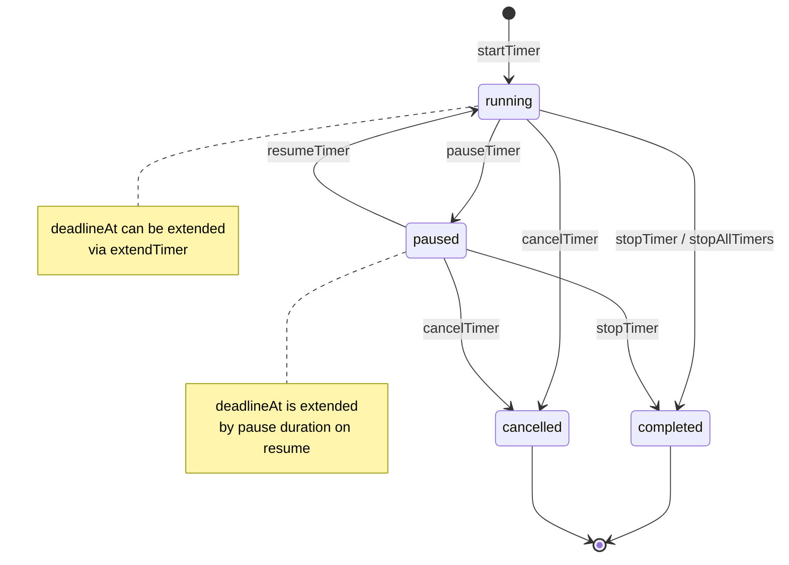
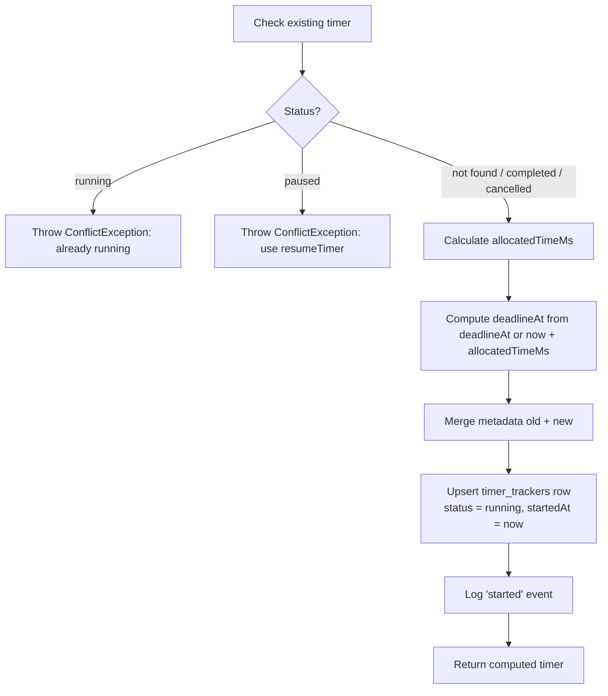
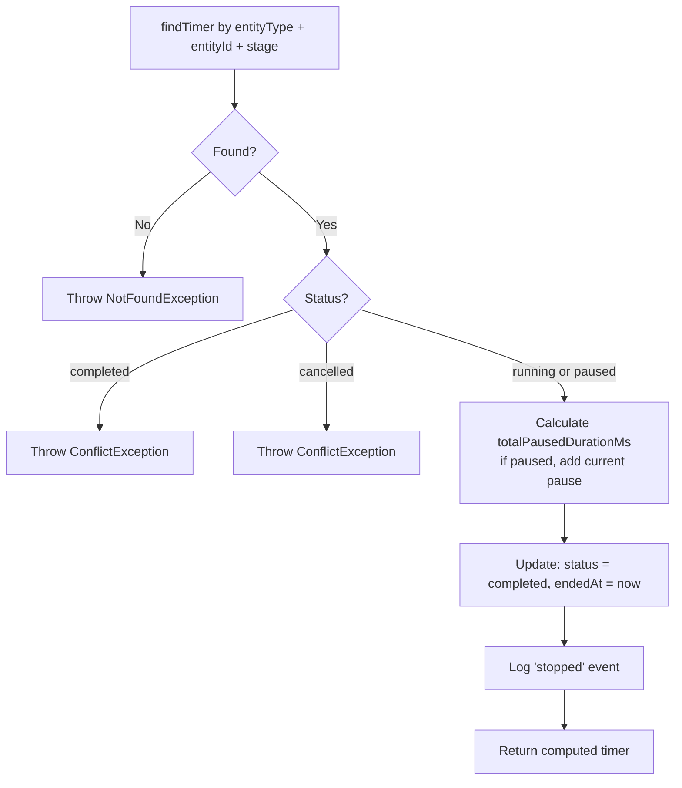
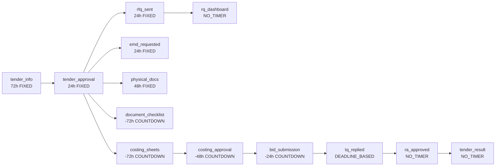
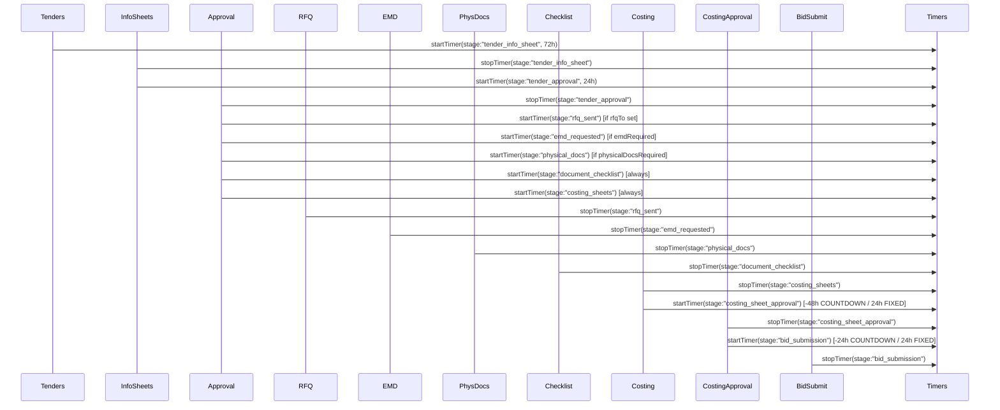

# Timer System

## 1. Architecture Overview

The timer system tracks time-based workflows in the tendering lifecycle. It lives in two layers:

```
api/src/
├── config/timer.config.ts                  ← Workflow definitions (what timers exist, their order, dependencies)
├── modules/timers/
│   ├── timers.service.ts                   ← Core service: start, stop, pause, resume, extend, cancel
│   ├── timer.types.ts                      ← TypeScript interfaces
│   └── timer-helper.ts                     ← Frontend batch-lookup helper
└── modules/tendering/                      ← Callers (one service per workflow stage)
    ├── tenders/                            ← starts tender_info_sheet timer on creation
    ├── info-sheets/                        ← stops tender_info_sheet, starts tender_approval
    ├── tender-approval/                    ← stops tender_approval, starts 5 downstream timers
    ├── costing-sheets/                     ← stops costing_sheets timer, starts costing_sheet_approval
    ├── rfqs/                               ← stops rfq_sent timer on send
    ├── payment-requests/                   ← stops emd_requested timer on request
    ├── physical-docs/                      ← stops physical_docs timer on submit
    ├── checklists/                         ← stops document_checklist timer on submit
    ├── costing-approvals/                  ← stops costing_sheet_approval timer, starts bid_submission
    └── bid-submissions/                    ← stops bid_submission timer on submit
```

### DB Tables

Defined in `api/src/db/schemas/workflow/timer.schema.ts`:

| Table | Purpose | Key columns |
|---|---|---|
| `timer_trackers` | One row per `(entityType, entityId, stage)` | `status`, `startedAt`, `deadlineAt`, `allocatedTimeMs`, `totalPausedDurationMs`, `totalExtensionMs`, `metadata` |
| `timer_events` | Audit log of every transition | `trackerId`, `eventType`, `previousStatus`, `newStatus`, `performedByUserId`, `reason`, `snapshot` |

---

## 2. Timer State Machine



### Transition Rules

| Transition | Precondition | Effect |
|---|---|---|
| `startTimer` | Not `running` or `paused` | Sets `running`, `startedAt = now`, resets counters |
| `stopTimer` | Not `completed` or `cancelled` | Sets `completed`, `endedAt = now` |
| `stopAllTimers` | Status `running` | Sets `stopped`, `endedAt = now`, reason "Bid Missed" |
| `pauseTimer` | Status `running` | Sets `paused`, `pausedAt = now` |
| `resumeTimer` | Status `paused`, `pausedAt` set | Adds pause to `totalPausedDurationMs`, extends `deadlineAt` |
| `cancelTimer` | Not `completed` or `cancelled` | Sets `cancelled`, `endedAt = now` |
| `extendTimer` | Not `completed` or `cancelled` | Adds to `totalExtensionMs`, pushes `deadlineAt` |

---

## 3. Core Service Functions

### 3.1 `startTimer(input: StartTimerInput)` → `TimerWithComputed`

**File:** `timers.service.ts:15`

```typescript
interface StartTimerInput {
    entityId: number;
    entityType: string;   // "TENDER"
    stage: string;        // canonical stage name
    allocatedTimeMs?: number;
    timerConfig?: TimerConfig;
    assignedUserId?: number;
    assignedRole?: string;
    workflowCode?: string;
    stepOrder?: number;
    deadlineAt?: Date;
    userId?: number;
    metadata?: Record<string, any>;
}
```

**Flow:**



**`allocatedTimeMs` calculation** (`calculateAllocatedTime`, line 456):

| TimerConfig.type | Formula |
|---|---|
| `FIXED_DURATION` | `durationHours * 3600000` (default 24h) |
| `DEADLINE_BASED` | `deadlineAt.getTime() - Date.now()` |
| `NEGATIVE_COUNTDOWN` | `deadlineAt.getTime() - Date.now()` (caller already bakes `hoursBeforeDeadline` into `deadlineAt`) |
| `NO_TIMER` | 0 |
| None / explicit | Use `input.allocatedTimeMs` if > 0, else 24h default |

### 3.2 `stopTimer(input: TimerActionInput)` → `TimerWithComputed`

**File:** `timers.service.ts:107`

```typescript
interface TimerActionInput {
    entityId: number;
    entityType: string;
    stage?: string;
    userId?: number;
    reason?: string;
}
```

**Flow:**



**The critical detail:** The `stage` passed to `stopTimer` must **exactly match** the `stage` used in `startTimer`. If they differ, step A throws `NotFoundException` because the composite key `(entityType, entityId, stage)` won't match any row.

### 3.3 `stopAllTimers(data)` → void

**File:** `timers.service.ts:142`

Finds all `running` timers for an entity and stops each one with reason "Bid Missed". Unlike `stopTimer`, the status is set to `stopped` (not `completed`), and it logs the reason in metadata. Used when a bid deadline passes without submission.

### 3.4 `pauseTimer(input)` → `TimerWithComputed`

**File:** `timers.service.ts:242`

Pauses a running timer. Records `pausedAt` timestamp. The deadline is **not** adjusted here — that happens on resume.

### 3.5 `resumeTimer(input)` → `TimerWithComputed`

**File:** `timers.service.ts:266`

Resumes a paused timer. Calculates the pause duration `(now - pausedAt)` and:
- Adds it to `totalPausedDurationMs`
- Extends `deadlineAt` by the same amount

This ensures the user doesn't lose time while the timer was paused.

### 3.6 `cancelTimer(input)` → `TimerWithComputed`

**File:** `timers.service.ts:303`

Marks a timer as `cancelled`. Cannot cancel if already `completed` or `cancelled`.

### 3.7 `extendTimer(input: ExtendTimerInput)` → `TimerWithComputed`

**File:** `timers.service.ts:328`

```typescript
interface ExtendTimerInput extends TimerActionInput {
    extensionMs: number;  // must be > 0
}
```

Adds `extensionMs` to `totalExtensionMs` and pushes `deadlineAt` forward. Cannot extend completed or cancelled timers.

---

## 4. `computeTimer()` — The Computed Timer Object

**File:** `timers.service.ts:513`

Every public method wraps the raw DB row through `computeTimer()` to produce the frontend-facing `TimerWithComputed`:

```typescript
interface TimerWithComputed {
    id: number;
    entityType: string;
    entityId: number;
    stage: string;
    status: string;
    timerType: string;
    allocatedTimeMs: number;
    totalExtensionMs: number;
    totalPausedDurationMs: number;
    effectiveAllocatedTimeMs: number;   // allocatedTimeMs + totalExtensionMs
    remainingTimeMs: number;            // time left (can be negative if overdue)
    elapsedTimeMs: number;              // time spent (excluding pauses)
    progressPercent: number;            // 0-100
    isWarning: boolean;                 // progress >= warningThreshold
    isCritical: boolean;                // progress >= criticalThreshold
    isOverdue: boolean;                 // running && remainingTimeMs <= 0
    startedAt: Date | null;
    endedAt: Date | null;
    pausedAt: Date | null;
    deadlineAt: Date | null;
    assignedUserId: number | null;
    assignedRole: string | null;
    workflowCode: string | null;
    stepOrder: number | null;
    warningThreshold: number;
    criticalThreshold: number;
    metadata: Record<string, any>;
    createdAt: Date;
    updatedAt: Date;
}
```

### `remainingTimeMs` Logic

| Condition | Formula |
|---|---|
| Completed/Cancelled + has `deadlineAt` + has `endedAt` | `deadlineAt - endedAt` (fallback: `effectiveAllocatedTimeMs - (endedAt - startedAt - totalPaused)`) |
| Running/Paused + has `deadlineAt` | `max(0, deadlineAt - now + currentPauseDurationMs)` |
| Has `startedAt` (fallback) | `max(0, effectiveAllocatedTimeMs - elapsedTimeMs)` |
| Neither | 0 |

---

## 5. Workflow Configuration (`timer.config.ts`)

The source of truth for the tendering workflow pipeline:



Key config properties per step:

| Property | Description |
|---|---|
| `stepKey` | **Canonical stage name** — used as `stage` in all start/stop calls |
| `stepOrder` | Display ordering in workflow UI |
| `assignedRole` | `TE` (Team Executive) or `TL` (Team Leader) |
| `timerConfig.type` | `FIXED_DURATION`, `DEADLINE_BASED`, `NEGATIVE_COUNTDOWN`, `DYNAMIC`, `NO_TIMER` |
| `dependsOn` | Array of `stepKey` values this step depends on |
| `canRunInParallel` | Whether this step can run concurrently with siblings |
| `isOptional` | Whether this step can be skipped |
| `conditional` | Object with `field`, `operator`, `value` to conditionally enable |

---

## 6. End-to-End Tender Timer Flow



### Detailed Step Descriptions

**Step 1 — Tender Created** (`tenders.service.ts:636`):
- Starts `tender_info_sheet` timer with 72h `FIXED_DURATION`.

**Step 2 — Info Sheet Filled** (`info-sheets.service.ts:661, 679`):
- Stops `tender_info_sheet` timer.
- Starts `tender_approval` timer with 24h `FIXED_DURATION`.

**Step 3 — Tender Approved** (`tender-approval.service.ts:554, 578-632`):
- Stops `tender_approval` timer.
- Starts multiple downstream timers based on tender configuration:
  - `rfq_sent` — if `rfqTo` is set (not "0" or "1").
  - `emd_requested` — if `emdRequired` is "YES" or "1".
  - `physical_docs` — if physical docs required and not "ONLY_EMD".
  - `document_checklist` — always.
  - `costing_sheets` — always.
- If `dueDate` exists, `document_checklist` and `costing_sheets` use `NEGATIVE_COUNTDOWN` with -72h before deadline. Others use 24h `FIXED_DURATION`.
- Each start is in a try-catch — `ConflictException` (already running) is logged as "skipping", other errors are logged as "Failed to start timer".

**Step 4-10 — Individual Stage Completions**:
- Each service stops its respective timer on submission/approval.
- After stopping, costing-sheets and costing-approvals also **start the next downstream timer**:
  - Costing sheets submitted → `costing_sheet_approval` started with `NEGATIVE_COUNTDOWN` at `dueDate - 48h` (or 24h `FIXED_DURATION` if no due date).
  - Costing approved → `bid_submission` started with `NEGATIVE_COUNTDOWN` at `dueDate - 24h` (or 24h `FIXED_DURATION` if no due date).
- All timer calls are wrapped in try-catch — `ConflictException` (already running/completed/cancelled) is logged as "skipping", other errors log the failure message.
- **Error propagation**: In `tender-approval.service.ts`, non-`ConflictException` errors from the start loop are **rethrown** so the caller knows the approval partially failed. The outer catch propagates the error after logging.

---

## 7. Performance / Leaderboard Integration

**Files:**
- `performance/config/stage-config.ts` — `STAGE_CONFIG` maps each `stageKey` (canonical name) to `timerName` for performance scoring.
- `performance/config/stage-backlog.config.ts` — Backlog stage keys used for KPI bucket calculations.
- `performance/team-leader-performance/team-leader-performance.service.ts` — Computes TL scores by querying `timer_trackers` using `stage.stageKey` from `STAGE_CONFIG`.

The `stageKey` values in these configs must match the canonical `stepKey` values in `timer.config.ts` and the `stage` values used in start/stop calls. They now all agree.

---

## 8. Frontend Integration

**File:** `timer-helper.ts`

`getFrontendTimersBatch(service, entityType, entityIds, stage)`:
- Queries `timersService.getTimersByEntityIds()` with the given `stage`.
- Returns `Map<number, TimerWithComputed>` keyed by `entityId`.
- Each tendering controller calls this right after fetching its list data, then attaches the timer to each item for the frontend to render a timer bar.

---

## 9. Common Failure Modes

| Scenario | Exception | Where caught | Resolution |
|---|---|---|---|
| **Stage name mismatch** (start uses `costing_sheets`, stop uses `costing_sheet`) | `NotFoundException` ("Timer not found") | Caller catch → "Failed to stop timer" | ✅ **Fixed** — all names now canonical |
| No timer exists for that (entity, stage) | `NotFoundException` | Caller catch → "Failed to stop timer" | ✅ **Fixed** — all timers now started by upstream step (`costing_sheet_approval`, `bid_submission` were missing) |
| Timer already `completed` on stop | `ConflictException` | Caller catch → "skipping" | Already handled |
| Timer already `cancelled` on stop | `ConflictException` | Caller catch → "skipping" | Already handled |
| Timer already `running` on start | `ConflictException` | Caller catch → "skipping" | Already handled |
| Timer `paused` on start | `ConflictException` ("use resumeTimer") | Caller catch → "skipping" | Already handled |
| DB write failure / race condition | Generic `Error` | Caller catch → "Failed to start/stop timer" | Needs retry logic |
| Repeated workflow action (double click) | Depends on state | Varies | Needs idempotency guards |

---

## 10. Naming Convention Reference

These are the **canonical stage names** used everywhere:

| Canonical `stage` | Started by | Stopped by |
|---|---|---|
| `tender_info_sheet` | `tenders.service.ts` | `info-sheets.service.ts` |
| `tender_approval` | `info-sheets.service.ts` | `tender-approval.service.ts` |
| `rfq_sent` | `tender-approval.service.ts` | `rfq.service.ts` |
| `emd_requested` | `tender-approval.service.ts` | `payment-requests.command.service.ts` |
| `physical_docs` | `tender-approval.service.ts` | `physical-docs.service.ts` |
| `document_checklist` | `tender-approval.service.ts` | `document-checklists.service.ts` |
| `costing_sheets` | `tender-approval.service.ts` | `costing-sheets.service.ts` |
| `costing_sheet_approval` | `costing-sheets.service.ts` | `costing-approvals.service.ts` |
| `bid_submission` | `costing-approvals.service.ts` | `bid-submissions.service.ts` |
